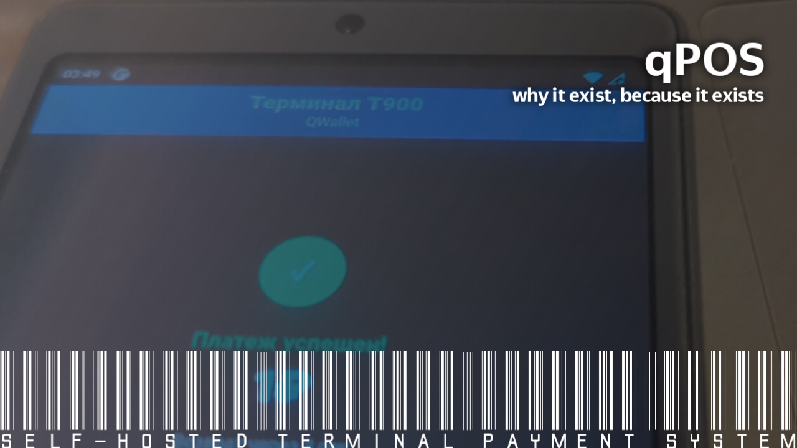

# qPOS


A modern payment POS terminal system with NFC (not integrated yet) and QR code payment support via QWallet

and yeah, made with funny ai

## Features

- 💳 **Multiple Payment Methods**
  - NFC contactless payments
  - QR code payments
  - Hybrid mode (NFC + QR) [currently not integrated]
  
- 🖥️ **Terminal Interface**
  - Normal UI
  - Real-time payment status updates
  - WebSocket-based communication
  
- 🔐 **Admin Panel**
  - Secure API authentication
  - Terminal management
  - Payment monitoring
  - System statistics
  
- 🏦 **QWallet Integration included**
  - Complete payment processing
  - Real-time notifications
  - Multi-terminal support
  
- 📊 **Payment Systems included with POS**
  - Visa
  - Mastercard
  - МИР (Russian Payment Method)
  - OVLPay (QWallet)

## Quick Start

### Prerequisites

- Node.js (latest) 
- npm or yarn

### Installation

```bash
# Clone the repository
git clone <repository-url>
cd payment-terminal-system

# Install dependencies
npm install
```

### Configuration

1. Copy the environment template:
```bash
cp .env.template .env
```

2. Configure your settings in `.env` (optional):
```env
# Admin credentials
ADMIN_USERNAME=admin
ADMIN_PASSWORD=admin123

# JWT secret
JWT_SECRET=your-secret-key-here

# Server ports
PORT=3030
QWALLET_PORT=3000
```

### Running the System

#### Start Terminal System

```bash
./initialization.sh
```

This will start the Terminal System on port 3030.

**Important:** The QWallet server must be started separately in its own folder:

```bash
cd /path/to/qwallet
node qwallet-server-es.mjs
```

The QWallet server should run on port 3000 for integration to work.

#### Start Manually

**Terminal System:**
```bash
node start-server-simple.js
```

**QWallet Server (in QWallet folder):**
```bash
node qwallet-server-es.mjs
```

#### Stop Servers

```bash
./stop-all-servers.sh
```

Or manually:
```bash
pkill -9 node
```

## Usage

### Admin Panel

Access the admin panel at: http://localhost:3030/admin

**Default credentials:**
- Username: `admin`
- Password: `admin123`

**Features:**
- View all terminals
- Monitor payments
- System statistics
- Create test payments

### Terminal Interface

Access terminals at: http://localhost:3030/terminal/{TERMINAL_ID}

**Available terminals:**
- T001 (Password: `password123`)
- T900 (Password: `2535`)
- T100 (Password: `password123`)

**Terminal workflow:**
1. Login with terminal password
2. Wait for payment request
3. Process payment (NFC or QR)
4. View payment result
5. Return to idle state

### API Endpoints

#### Terminal System API (Port 3030)

**Authentication:**
```bash
POST /api/admin/auth
Content-Type: application/json

{
  "username": "admin",
  "password": "admin123"
}
```

**Create Payment:**
```bash
POST /api/admin/test-payment
Authorization: Bearer {token}
Content-Type: application/json

{
  "terminalId": "T900",
  "amount": 10000,
  "method": "qr"
}
```

**Get Terminals:**
```bash
GET /api/terminals
```

**Get Payments:**
```bash
GET /api/payments?terminalId=T900&status=completed
```

#### QWallet API (Port 3000)

**Complete Payment:**
```bash
POST /api/payment/complete
Content-Type: application/json

{
  "amount": 100,
  "currency": "RUB",
  "terminalId": "T900"
}
```

**Health Check:**
```bash
GET /api/health
```

## Architecture

```
┌─────────────────┐         ┌──────────────────┐         ┌─────────────────┐
│   Terminal UI   │◄────────┤ Terminal System  │◄────────┤  QWallet Server │
│  (Browser)      │WebSocket│   (Port 3030)    │  HTTP   │   (Port 3000)   │
│                 │         │                  │         │                 │
│  - Login        │         │  - Admin API     │         │  - Payment API  │
│  - Payment UI   │         │  - Terminal API  │         │  - Completion   │
│  - Status       │         │  - WebSocket     │         │  - Notification │
└─────────────────┘         └──────────────────┘         └─────────────────┘
         │                           │                            │
         │                           ▼                            │
         │                  ┌─────────────────┐                   │
         │                  │   SQLite DB     │                   │
         │                  │                 │                   │
         │                  │  - Terminals    │                   │
         │                  │  - Payments     │                   │
         │                  │  - QR Codes     │                   │
         │                  └─────────────────┘                   │
         │                                                        │
         └────────────────────────────────────────────────────────┘
                          Payment Flow
```

## Payment Flow

### QR Code Payment

1. Admin creates payment request
2. Terminal displays QR code
3. User scans QR code with mobile app
4. QWallet processes payment
5. QWallet notifies Terminal System
6. Terminal System sends WebSocket notification
7. Terminal displays success screen
8. Terminal returns to idle

### NFC Payment

1. Admin creates payment request
2. Terminal shows "Tap card" screen
3. User taps NFC card
4. Terminal sends card data to system
5. System processes with bank API
6. Terminal displays result
7. Terminal returns to idle

## Development

### Project Structure

```
payment-terminal-system/
├── src/
│   ├── database/          # Database layer
│   ├── middleware/        # Express middleware
│   ├── models/           # Data models
│   ├── routes/           # API routes
│   ├── services/         # Business logic
│   └── tests/            # Test files
├── public/
│   ├── admin.html        # Admin panel
│   ├── terminal.html     # Terminal interface
│   └── images/           # Assets
├── data/                 # SQLite database
├── logs/                 # Log files
├── start-server-simple.js # Terminal system server
└── package.json
```

### Running Tests

```bash
# Run all tests
npm test

# Run tests in watch mode
npm run test:watch
```

### Database

The system uses SQLite for data storage. The database is automatically created on first run.

**Tables:**
- `terminals` - Terminal information
- `payments` - Payment records
- `qr_codes` - QR code data
- `payment_systems` - Supported payment systems

**Database location:** `data/payment_terminal.db`

**Backup:** Automatic backups are created in `data/` directory

## Configuration

### Terminal Configuration

Edit terminals in the database or via admin panel:

```sql
INSERT INTO terminals (id, name, operator, status, location, password)
VALUES ('T001', 'Terminal 1', 'Main Store', 'active', 'Floor 1', 'password123');
```

### Payment Systems

Payment systems are configured in the database:

```sql
INSERT INTO payment_systems (id, name, display_name, logo_url, is_active, sort_order)
VALUES ('visa', 'visa', 'Visa', '/images/payment-systems/visa.svg', 1, 1);
```

## Security

### Admin Authentication

- JWT-based authentication
- 24-hour token expiration
- Session management
- Password protection

### Terminal Authentication

- Password-based terminal access
- Terminal-specific credentials
- Session tracking

### Best Practices

1. Change default admin password
2. Use environment variables for secrets
3. Enable HTTPS in production
4. Implement rate limiting
5. Regular security audits

## Troubleshooting

### Server Won't Start

```bash
# Kill existing processes
pkill -9 node

# Check ports
lsof -i :3030
lsof -i :3000

# Restart
./start-both-servers.sh
```

### Terminal Not Updating

1. Check WebSocket connection in browser console
2. Verify terminal is logged in
3. Check server logs
4. Refresh terminal page

### Database Issues

```bash
# Restore from backup
cp data/payment_terminal_backup_*.db data/payment_terminal.db

# Or remove and recreate
rm data/payment_terminal.db
node start-server-simple.js
```

### Port Already in Use

```bash
# Find process using port
lsof -i :3030

# Kill the process
kill -9 <PID>
```

## API Documentation

See [MOBILE_API.md](MOBILE_API.md) for detailed mobile API documentation.

## Contributing

1. Fork the repository
2. Create a feature branch
3. Make your changes
4. Add tests
5. Submit a pull request

## License

MIT License - see LICENSE file for details

## Support

For issues and questions:
- Open an issue on GitHub
- Check existing documentation
- Review troubleshooting guide

## Changelog

### Version 1.0.0

- Initial release
- NFC (not integrated because of HTTPS requirement, and QR payment support)
- Admin panel
- Terminal interface
- QWallet integration
- Multi-terminal support
- WebSocket notifications
- Payment completion flow

## Acknowledgments

- Express.js for web framework
- SQLite for database
- WebSocket for real-time communication
- QRCode.js for QR code generation
